## Download

* Visit the [Visual Studio Code](https://code.visualstudio.com/) website and download the program

:::caution
Make sure you check the "Open with code" boxes!
:::

## Extensions

* [Sumneko lua extension](https://marketplace.visualstudio.com/items?itemName=sumneko.lua)

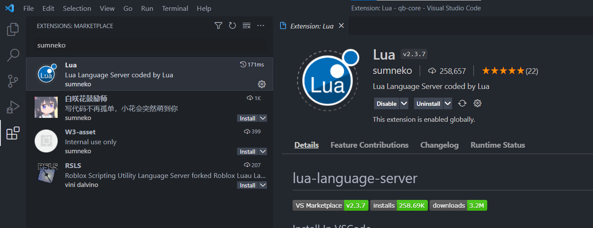

* [Gccfeli lua formatter](https://marketplace.visualstudio.com/items?itemName=gccfeli.vscode-lua)

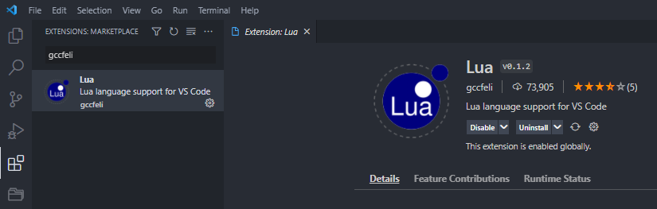

* [Prettier code formatter](https://marketplace.visualstudio.com/items?itemName=esbenp.prettier-vscode) (_JavaScript, TypeScript, CSS, HTML, Vue, JSX_)

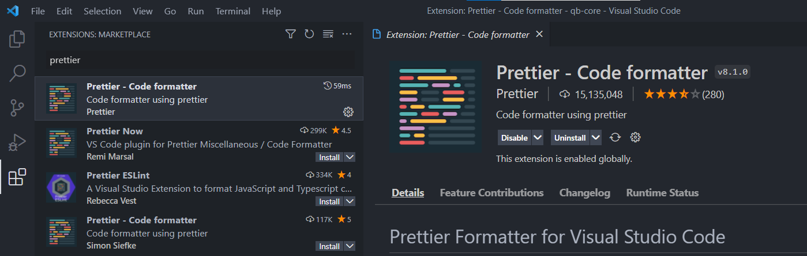

* [FiveM natives](https://marketplace.visualstudio.com/items?itemName=overextended.cfxlua-vscode)

<figure><figcaption></figcaption></figure>

* [Material icon theme](https://marketplace.visualstudio.com/items?itemName=PKief.material-icon-theme) (cosmetic only)

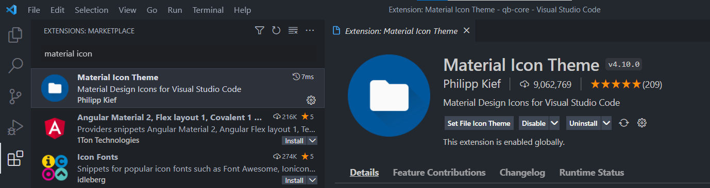

* [One Dark Pro](https://marketplace.visualstudio.com/items?itemName=zhuangtongfa.Material-theme) (cosmetic only)

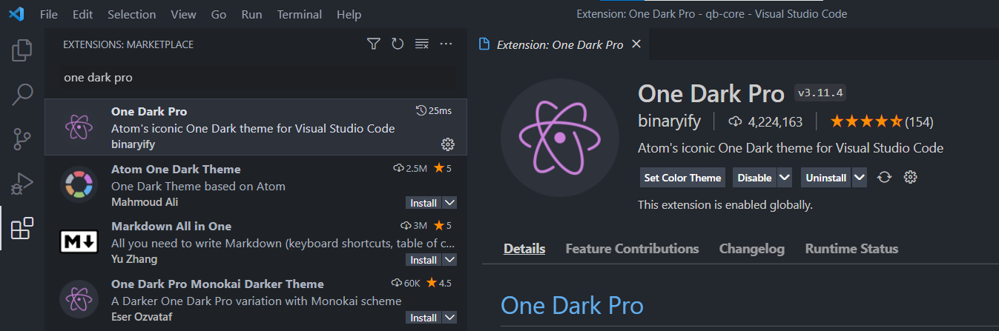

* [QBCore Snippets](https://marketplace.visualstudio.com/items?itemName=JericoFX.qb-core-snippets)

<figure>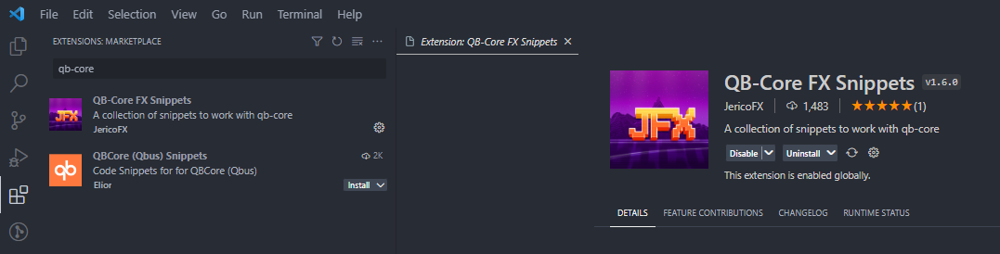<figcaption></figcaption></figure>

## Fonts

### Fira Code

:::note
Download file, double click the ttf files and install the font
:::



:::tip
File -> Preferences -> Settings -> Font Family -> Fira Code
:::

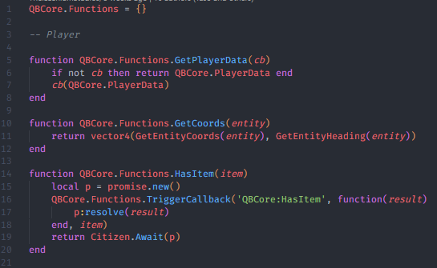

### JetBrains Mono

:::note
Download file, double click the ttf files you want and install the font
:::



:::tip
File -> Preferences -> Settings -> Font Family -> JetBrains Mono
:::

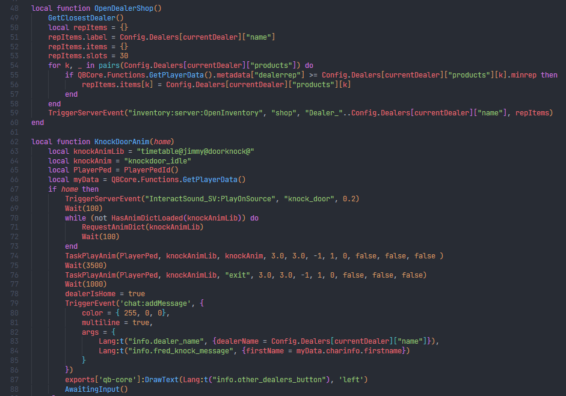

## Extension Settings

:::note
You can search for these through File -> Preferences -> Settings
:::

### Sumneko

Built-in lua diagnostics

* undefined-global
* err-nonstandard-symbol
* unknown-symbol

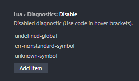

Trim trailing whitespace on file save

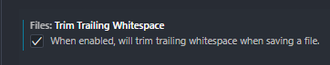

### One Dark Pro

Selecting a theme

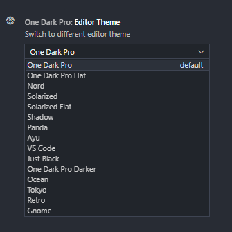

## Opening a folder

:::note
You can also do File -> Open Folder...
:::

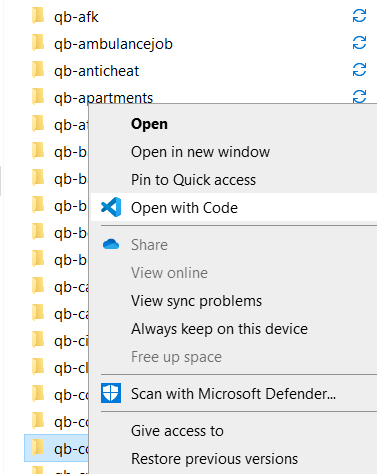

## Global Searching

:::note
Can be accessed via the magnifying glass or using the keyboard shortcuts `Shift` + `CTRL` + `F` (varies by user if you've changed them)
:::

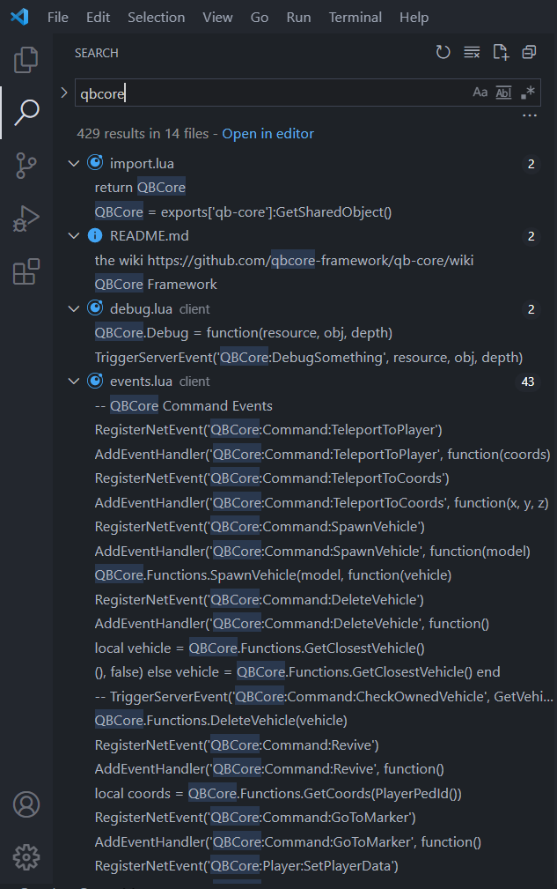

## GitHub Integration

:::danger
Must have [git](https://git-scm.com/downloads) installed!
:::

:::note
There is some configuring to do with these extensions but most of it is just signing into your GitHub account and exploring the "source control" tab on the left!
:::

### Extensions

* Download the [Git Extension Pack](https://marketplace.visualstudio.com/items?itemName=donjayamanne.git-extension-pack)

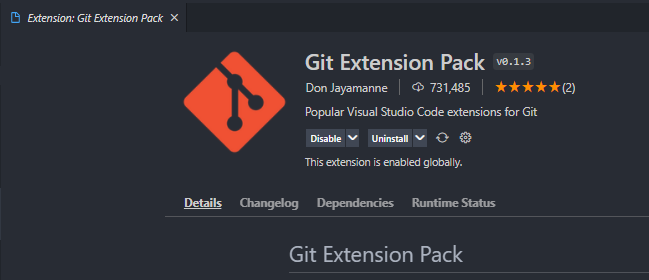

* Download [GitHub Pull Requests and Issues](https://marketplace.visualstudio.com/items?itemName=GitHub.vscode-pull-request-github)

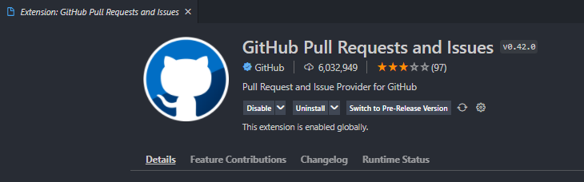

* Sign up for [GitHub Copilot](https://copilot.github.com/) and install (optional)

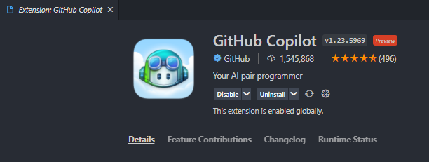
