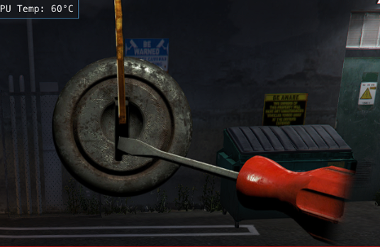

## Introduction

* This is a JavaScript mini game that test players skills by rotating the lockpick to a certain angle and engaging the screwdriver which returns success or failure

## Preview



## Configuration

:::tip
This resource requires no configuration and has no dependencies
:::

## Usage Example

```lua
local function lockpickFinish(success) -- callback function
	if success then print('Player succeeded') end
	print('Player failed')
end

RegisterCommand("testlockpick", function()
	TriggerEvent('qb-lockpick:client:openLockpick', lockpickFinish)
end) 
```
