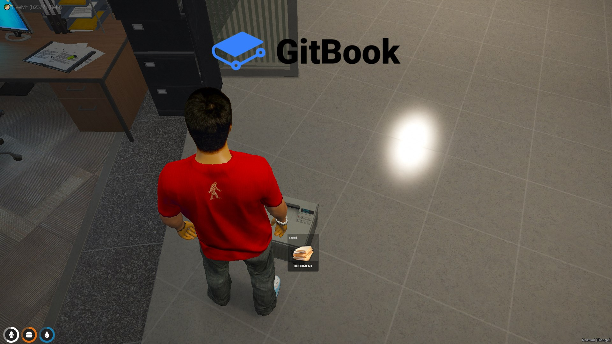

## Introduction

* Let players use a printer via command when nearby and upload an image to a document for viewing

## Preview

## Configuration

:::tip
This resource requires no configuration and has no dependencies
:::

## Commands

* /useprinter - Players can use a printer when they are near one
* /spawnprinter - Create a printer at your location to be used

## Items

* printerdocument - Item given to player when using printer, use to view the document
